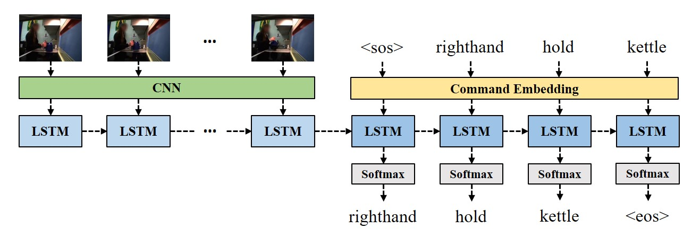

# video2command
A PyTorch adapted implementation of the video-to-command model described in the paper:

"[Translating Videos to Commands for Robotic Manipulation with Deep Recurrent Neural Networks](https://sites.google.com/site/video2command/)" in ICRA 2018. Check the author's [original implementation](https://github.com/nqanh/video2command) in Tensorflow.

## Requirements
- PyTorch (tested on 1.3)
- TorchVision
- numpy
- PIL
- coco-caption, a [modified version](https://github.com/flauted/coco-caption/tree/python23) is used to support Python3
- OpenCV (optional, if you need to extract features on your own video)

## Introduction
The *video2command* model is an Encoder-Decoder neural network that learn to generate a short sentence which can be used to command a robot to perform various manipulation tasks. The architecture of the network is listed below:

    <figure> 
        
    </figure>        

Compared to the architecture used in the [original implementation](https://github.com/nqanh/video2command), the implementation here takes more inspiration from the seq2seq architecture where we will inject the state of the video encoder directly into the command decoder instead. This promotes a 2~3% improvement in the BLEU 1-4 scores. 

## Experiment
To repeat the *video2command* experiment:
1. Clone the repository.

2. Download the [IIT-V2C dataset](https://sites.google.com/site/iitv2c/), extract the dataset and setup the directory path as `datasets/IIT-V2C`.

3. For CNN features, two options are provided:
     - Use the [pre-extracted ResNet50 features](https://drive.google.com/file/d/1Y_YKHB4Bw6MPXj05S36d1G_3rMx73Uv5/view?usp=sharing) provided by the original author.

     - Perform feature extraction yourself. Firstly run `avi2frames.py` under folder `experiments/experiment_IIT-V2C` to convert all videos into images. Download the [*.pth weights for ResNet50](https://github.com/ruotianluo/pytorch-resnet) converted from Caffe. Run `extract_features.py` under folder `experiments/experiment_IIT-V2C` afterwards.
     
     - Note that the author's pre-extracted features seem to have a better quality and lead to a possible 1~2% higher metric scores.

4. To begin training, run `train_iit-v2c.py`. 

5. For evaluation, firstly run `evaluate_iit-v2c.py` to generate predictions given all saved checkpoints. Run `cocoeval_iit-v2c.py` to calculate scores for the predictions.

## Additional Note
If you find this repository useful, please give me a star. Please leave me an issue if you find any potential bugs inside the code.

## References
Some references which help my implementation:

https://github.com/nqanh/video2command

https://github.com/ruotianluo/pytorch-resnet
